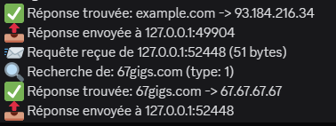
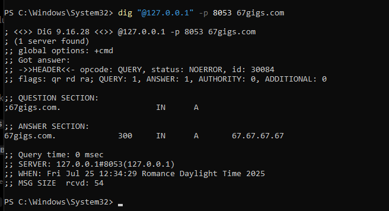

# TP 7: Client et Serveur DNS Simples

Un projet Rust implémentant un client et serveur DNS simple selon le RFC 1035, utilisant le protocole UDP et la programmation asynchrone avec Tokio.

## 📋 Description

Ce projet implémente :
- **Client DNS** : Capable de résoudre des noms de domaine en adresses IP
- **Serveur DNS** : Serveur DNS simple avec des enregistrements prédéfinis
- **Protocole DNS** : Implémentation basique du protocole DNS selon RFC 1035

### Fonctionnalités

- ✅ Parsing et génération de messages DNS (header, questions, réponses)
- ✅ Client DNS asynchrone avec support des serveurs publics (Google DNS, Cloudflare)
- ✅ Serveur DNS local avec enregistrements A prédéfinis
- ✅ Support des requêtes de type A (IPv4)
- ✅ Gestion d'erreurs robuste
- ✅ Interface en ligne de commande avec émojis pour une meilleure lisibilité

## 🛠️ Prérequis

- Rust (édition 2021 ou plus récente)
- Cargo

## 📦 Dépendances

```toml
[dependencies]
tokio = { version = "1.0", features = ["full"] }
byteorder = "1.4"
rand = "0.8"
```

## 🚀 Installation et Compilation

1. **Cloner le projet** :

```bash
git clone https://github.com/67Gigs/tp-rust.git
cd tp7-client-et-serveur-simple-dns
```

2. **Compiler le projet** :

```bash
cargo build
```

3. **Exécuter le programme principal** :
```bash
cargo run
```

## 🏃‍♂️ Utilisation

### Exécution du programme principal

Le programme principal démarre automatiquement :
1. Un serveur DNS local sur le port `8053`
2. Une série de tests du client DNS

```bash
cargo run
```

### Exécution des binaires séparés

Le projet est configuré avec deux binaires :

1. **Serveur DNS** :

```bash
cargo run --bin dns_server
```

2. **Client de test** (si créé) :

```bash
cargo run --bin test_client
```

## 🔧 Configuration

### Serveur DNS

Le serveur DNS inclut les enregistrements prédéfinis suivants :

| Domaine | Adresse IP |
|---------|------------|
| `example.com` | `93.184.216.34` |
| `test.local` | `127.0.0.1` |
| `server.local` | `192.168.1.100` |
| `dns.local` | `192.168.1.1` |
| `67gigs.com` | `67.67.67.67` |

### Port d'écoute

- **Port par défaut** : `8053` (évite les problèmes de permissions sur le port 53)
- **Adresse d'écoute** : `0.0.0.0:8053`

## 📖 Structure du Code

### Structures principales

#### `DnsHeader`

Représente l'en-tête DNS selon RFC 1035 :

```rust
struct DnsHeader {
    id: u16,           // Identifiant de la requête
    flags: u16,        // Flags (QR, OPCODE, AA, TC, RD, RA, Z, RCODE)
    qdcount: u16,      // Nombre de questions
    ancount: u16,      // Nombre de réponses
    nscount: u16,      // Nombre d'enregistrements d'autorité
    arcount: u16,      // Nombre d'enregistrements additionnels
}
```

#### `DnsQuestion`
Représente une question DNS :
```rust
struct DnsQuestion {
    name: String,      // Nom de domaine
    qtype: u16,        // Type de requête (A = 1)
    qclass: u16,       // Classe (IN = 1)
}
```

#### `DnsAnswer`
Représente une réponse DNS :
```rust
struct DnsAnswer {
    name: String,      // Nom de domaine
    atype: u16,        // Type de l'enregistrement
    aclass: u16,       // Classe
    ttl: u32,          // Time To Live
    rdlength: u16,     // Longueur des données
    rdata: Vec<u8>,    // Données de la réponse
}
```

### Composants

#### `DnsClient`
- Méthode `resolve()` pour résoudre des noms de domaine
- Support des serveurs DNS avec ou sans port spécifié
- Parsing simplifié des réponses DNS

#### `DnsServer`
- Serveur UDP asynchrone
- HashMap pour stocker les enregistrements DNS
- Méthode `handle_query()` pour traiter les requêtes entrantes

## 🧪 Tests

### Tests automatiques inclus

Le programme principal teste automatiquement :

1. **Serveur local** :
   - `test.local`
   - `server.local`
   - `dns.local`
   - `example.com`
   - `67gigs.com`
   - `nonexistent.local` (test d'échec)

2. **Serveurs DNS publics** :
   - `google.com` via Google DNS (`8.8.8.8`)
   - `cloudflare.com` via Cloudflare DNS (`1.1.1.1`)

### Tests manuels

Vous pouvez tester le serveur DNS avec des outils externes :

```bash
# Avec nslookup (Windows)
nslookup test.local 127.0.0.1 -port=8053

# Avec dig (Linux/macOS)
dig @127.0.0.1 -p 8053 test.local

# Avec PowerShell (Windows)
Resolve-DnsName -Name test.local -Server 127.0.0.1 -Port 8053
```

## 📝 Exemple de sortie

```
🌐 TP 7: Client et Serveur DNS Simples
=====================================
🚀 Serveur DNS démarré sur 0.0.0.0:8053
📋 Domaines disponibles:
   example.com -> 93.184.216.34
   test.local -> 127.0.0.1
   server.local -> 192.168.1.100
   dns.local -> 192.168.1.1
   67gigs.com -> 67.67.67.67

🔍 Test du client DNS:
----------------------
📤 Envoi de la requête DNS pour test.local vers 127.0.0.1:8053
📨 Requête reçue de 127.0.0.1:random_port (XX bytes)
🔍 Recherche de: test.local (type: 1)
✅ Réponse trouvée: test.local -> 127.0.0.1
📤 Réponse envoyée à 127.0.0.1:random_port
✅ Résolution réussie: test.local -> 127.0.0.1
✅ test.local résolu en 127.0.0.1
```

## ⚠️ Limitations

- **Parsing simplifié** : L'extraction des adresses IP des réponses DNS est basique
- **Type A uniquement** : Seuls les enregistrements de type A (IPv4) sont supportés
- **Pas de compression** : Les noms de domaine ne sont pas compressés selon RFC 1035
- **Enregistrements statiques** : Le serveur DNS utilise des enregistrements prédéfinis

## 🔮 Améliorations possibles

- [ ] Support des enregistrements AAAA (IPv6)
- [ ] Compression des noms de domaine
- [ ] Parsing complet des réponses DNS
- [ ] Support des enregistrements CNAME, MX, NS
- [ ] Interface de configuration dynamique
- [ ] Cache DNS côté client
- [ ] Support de la récursion DNS
- [ ] Authentification et sécurité (DNSSEC)

## Screen shots


