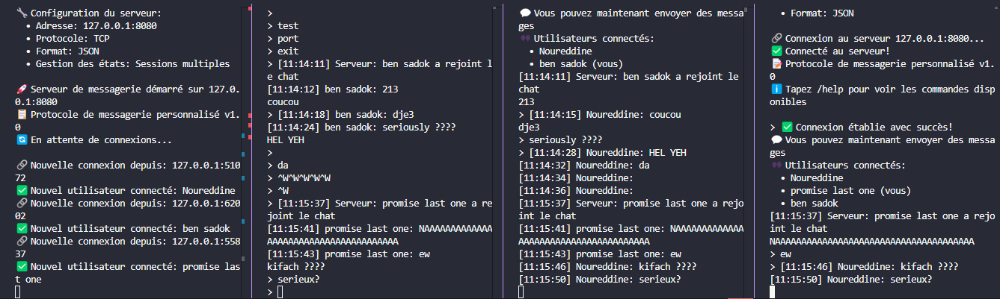

# TP 8: Implémentation d'un Protocole Personnalisé

## Description

Ce projet implémente un protocole de messagerie personnalisé au-dessus de TCP en Rust. Il comprend un serveur capable de gérer plusieurs clients simultanément et un client avec une interface interactive.

## Architecture du Protocole

### Format des Messages

Les messages sont échangés au format JSON avec la structure suivante :

```json
{
  "id": "uuid-v4",
  "op_code": "Connect|Disconnect|SendMessage|ListUsers|ConnectAck|DisconnectAck|MessageReceived|UserList|Error",
  "timestamp": "2025-01-25T10:30:00Z",
  "sender": "nom_utilisateur",
  "recipient": "destinataire_optionnel",
  "payload": {
    "type": "Connect|Disconnect|Text|UserList|Error|Empty",
    // Données spécifiques selon le type
  }
}
```

### Codes d'Opération

| OpCode | Direction | Description |
|--------|-----------|-------------|
| `Connect` | Client → Serveur | Demande de connexion |
| `Disconnect` | Client → Serveur | Demande de déconnexion |
| `SendMessage` | Client → Serveur | Envoi d'un message texte |
| `ListUsers` | Client → Serveur | Demande la liste des utilisateurs |
| `ConnectAck` | Serveur → Client | Confirmation de connexion |
| `DisconnectAck` | Serveur → Client | Confirmation de déconnexion |
| `MessageReceived` | Serveur → Client | Message d'un autre utilisateur |
| `UserList` | Serveur → Client | Liste des utilisateurs connectés |
| `Error` | Serveur → Client | Message d'erreur |

### Types de Payload

- **Connect** : `{ "type": "Connect", "username": "nom" }`
- **Text** : `{ "type": "Text", "content": "message" }`
- **UserList** : `{ "type": "UserList", "users": ["user1", "user2"] }`
- **Error** : `{ "type": "Error", "code": 400, "message": "description" }`
- **Empty** : `{ "type": "Empty" }`

### Codes d'Erreur

- `400` : Message invalide
- `401` : Non autorisé (pas connecté)
- `409` : Utilisateur déjà connecté
- `500` : Erreur interne du serveur

## Fonctionnalités

### Serveur

- ✅ Gestion de connexions TCP multiples
- ✅ Authentification par nom d'utilisateur unique
- ✅ Diffusion des messages à tous les clients connectés
- ✅ Gestion des états de session
- ✅ Notification des connexions/déconnexions
- ✅ Liste des utilisateurs connectés
- ✅ Validation des messages
- ✅ Gestion robuste des erreurs

### Client

- ✅ Interface interactive en ligne de commande
- ✅ Connexion/déconnexion au serveur
- ✅ Envoi de messages texte
- ✅ Réception des messages en temps réel
- ✅ Commandes spéciales (/help, /users, /quit)
- ✅ Affichage horodaté des messages

## Installation et Compilation

```bash
# Naviguer vers le dossier du projet
cd tp8-implementation-d-un-protocol

# Compiler le projet
cargo build --release

# Ou compiler et exécuter directement
cargo run
```

## Utilisation

### Mode Interactif (Recommandé)

```bash
cargo run
```

Suivez les instructions à l'écran pour choisir entre serveur et client.

### Lancement Direct

#### Serveur

```bash
# Serveur sur le port par défaut (127.0.0.1:8080)
cargo run server

# Serveur sur une adresse spécifique
cargo run server 0.0.0.0:9999
```

#### Client

```bash
# Client avec nom d'utilisateur (serveur par défaut)
cargo run client Alice

# Client avec serveur spécifique
cargo run client Bob 192.168.1.100:8080
```

## Test du Protocole

### Scénario de Test

1. **Démarrer le serveur** :

   ```bash
   cargo run server
   ```

2. **Connecter le premier client** (terminal 2) :

   ```bash
   cargo run client Alice
   ```

3. **Connecter le deuxième client** (terminal 3) :

   ```bash
   cargo run client Bob
   ```

4. **Test des fonctionnalités** :
   - Envoi de messages entre clients
   - Commande `/users` pour voir les utilisateurs connectés
   - Commande `/help` pour l'aide
   - Déconnexion avec `/quit`

### Commandes Client

| Commande | Description |
|----------|-------------|
| `/help` | Affiche l'aide |
| `/users` ou `/list` | Liste les utilisateurs connectés |
| `/disconnect` | Se déconnecte du serveur |
| `/quit` ou `/exit` | Quitte l'application |
| `message` | Envoie un message à tous |

## Gestion des Erreurs

Le protocole gère robustement :

- Connexions fermées inopinément
- Messages malformés
- Tentatives de connexion avec un nom déjà utilisé
- Commandes non autorisées (sans connexion)
- Erreurs de sérialisation/désérialisation

## Architecture Technique

### Modules

- **`protocol.rs`** : Définition du protocole, structures de données
- **`server.rs`** : Implémentation du serveur multi-client
- **`client.rs`** : Implémentation du client interactif
- **`main.rs`** : Point d'entrée et interface utilisateur

### Dépendances

- **`tokio`** : Runtime asynchrone pour la programmation réseau
- **`serde`** : Sérialisation/désérialisation des structures
- **`serde_json`** : Support JSON pour serde
- **`uuid`** : Génération d'identifiants uniques
- **`chrono`** : Gestion des dates/heures

### Concepts Rust Avancés Utilisés

- **Programmation asynchrone** avec `async/await`
- **Gestion de la mémoire partagée** avec `Arc<Mutex<T>>`
- **Canaux de communication** avec `broadcast` et `mpsc`
- **Sérialisation automatique** avec derive macros
- **Gestion d'erreurs** avec `Result<T, E>`
- **Pattern matching** avancé
- **Traits** pour l'extensibilité

## Extensions Possibles

1. **Chiffrement** : Ajouter TLS pour sécuriser les communications
2. **Messages privés** : Implémenter le chat 1-to-1
3. **Salles de chat** : Créer des channels séparés
4. **Persistance** : Sauvegarder l'historique des messages
5. **Interface graphique** : Remplacer l'interface CLI
6. **Authentification** : Ajouter un système de mots de passe
7. **Compression** : Compresser les messages volumineux

## Validation du Protocole

Le protocole implémenté respecte les exigences du TP :

- ✅ **Protocole personnalisé** défini avec des règles claires
- ✅ **Format de messages** structuré avec en-têtes et corps
- ✅ **Codes d'opération** pour différents types d'échanges
- ✅ **Sérialisation/désérialisation** avec serde_json
- ✅ **Gestion des états** pour les sessions clients
- ✅ **Robustesse** avec validation et gestion d'erreurs
- ✅ **Client et serveur interopérables**
- ✅ **Architecture modulaire** et extensible

Ce projet démontre une maîtrise complète de la programmation réseau en Rust et des concepts avancés de conception de protocoles.

## Screen shot


