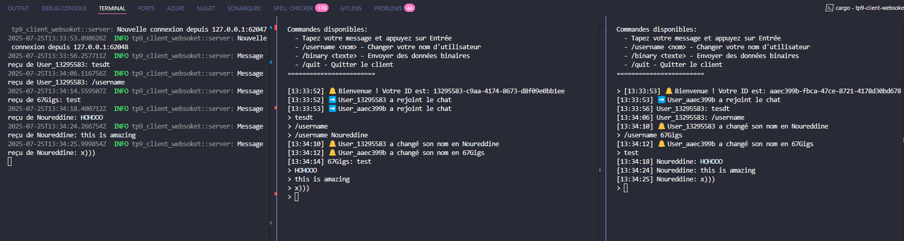

# TP 9: Serveur et Client WebSocket

Ce projet implémente un serveur et un client WebSocket en Rust utilisant la crate `tokio-tungstenite`. Il démontre la communication bidirectionnelle persistante entre clients et serveur, idéale pour les applications en temps réel.

## 🎯 Objectifs Pédagogiques

- Comprendre le protocole WebSocket et son utilité
- Implémenter un serveur WebSocket capable de gérer plusieurs connexions
- Développer un client WebSocket pour interagir avec le serveur
- Gérer les messages WebSocket (texte, binaire)
- Utiliser la programmation asynchrone avec Tokio

## 🔧 Concepts Clés Illustrés

### 1. Protocole WebSocket
- **Handshake WebSocket** : Négociation initiale entre client et serveur
- **Communication full-duplex** : Échange bidirectionnel de messages
- **Connexion persistante** : Maintien de la connexion pour les échanges en temps réel

### 2. Gestion Asynchrone
- **Tokio** : Runtime asynchrone pour Rust
- **tokio-tungstenite** : Implémentation WebSocket asynchrone
- **Tâches concurrentes** : Gestion simultanée de multiples connexions

### 3. Types de Messages
- **Messages texte** : Communication standard
- **Messages binaires** : Transmission de données binaires
- **Messages de contrôle** : Gestion de la connexion (ping, pong, close)

## 🚀 Utilisation

### Démarrer le serveur
```bash
cargo run server
```
Le serveur écoute sur `127.0.0.1:8080`

### Démarrer un client
```bash
# Client vers le serveur local
cargo run client

# Client vers une URL spécifique
cargo run client ws://127.0.0.1:8080
```

### Client simple
```bash
cargo run simple-client
```

### Démonstration complète
```bash
cargo run demo
```

## 💬 Fonctionnalités du Chat

### Commandes Client
- **Message normal** : Tapez votre message et appuyez sur Entrée
- **`/username <nom>`** : Changer votre nom d'utilisateur
- **`/binary <texte>`** : Envoyer des données binaires
- **`/quit`** : Quitter le client

### Fonctionnalités Serveur
- **Multi-client** : Gestion de multiples connexions simultanées
- **Broadcasting** : Diffusion des messages à tous les clients connectés
- **Notifications système** : Annonces d'arrivée/départ des utilisateurs
- **Gestion d'état** : Suivi des clients connectés avec informations

## 🏗️ Architecture

### Structure du Projet
```
src/
├── main.rs          # Point d'entrée principal
├── server.rs        # Implémentation du serveur WebSocket
└── client.rs        # Implémentation du client WebSocket
```

### Composants Principaux

#### `server.rs`
- **`WebSocketServer`** : Structure principale du serveur
- **`ChatMessage`** : Structure pour les messages du chat
- **`Client`** : Informations des clients connectés
- **Gestion des connexions** : Handshake, réception/envoi de messages
- **Broadcasting** : Diffusion des messages à tous les clients

#### `client.rs`
- **`WebSocketClient`** : Structure du client WebSocket
- **Interface utilisateur** : Gestion des commandes et affichage
- **Gestion asynchrone** : Réception/envoi simultané de messages

## 🔍 Détails Techniques

### Handshake WebSocket
```rust
// Côté serveur - accepter la connexion
let ws_stream = accept_async(stream).await?;

// Côté client - se connecter au serveur
let (ws_stream, _) = connect_async(&server_url).await?;
```

### Gestion des Messages
```rust
// Messages texte
Message::Text(text) => { /* traitement */ }

// Messages binaires
Message::Binary(data) => { /* traitement */ }

// Fermeture de connexion
Message::Close(_) => { /* nettoyage */ }
```

### Broadcasting
```rust
// Canal de diffusion pour les messages
let (tx, _) = broadcast::channel(1000);

// Diffuser un message à tous les clients
let _ = tx.send(chat_message);
```

### Gestion d'État Partagé
```rust
// État partagé entre les tâches
pub type Clients = Arc<Mutex<HashMap<String, Client>>>;
```

## 📊 Flux de Données

1. **Connexion Client** → Handshake WebSocket → Ajout à la liste des clients
2. **Message Client** → Réception serveur → Broadcasting → Diffusion aux autres clients
3. **Déconnexion Client** → Nettoyage → Notification aux autres clients

## 🧪 Tests et Validation

### Test Multi-Clients
1. Démarrez le serveur : `cargo run server`
2. Ouvrez plusieurs terminaux
3. Lancez des clients : `cargo run client`
4. Échangez des messages entre les clients

### Test des Types de Messages
- **Texte** : Messages normaux
- **Binaire** : Utilisez `/binary <texte>`
- **Système** : Changement de nom avec `/username`

## 🔧 Dépendances

- **`tokio`** : Runtime asynchrone
- **`tokio-tungstenite`** : Implémentation WebSocket
- **`futures-util`** : Utilitaires pour les futures
- **`serde`** : Sérialisation/désérialisation
- **`uuid`** : Génération d'identifiants uniques
- **`tracing`** : Système de logging
- **`chrono`** : Gestion des dates et heures

## 🎓 Points d'Apprentissage

### Protocole WebSocket
- Comprendre la différence avec HTTP classique
- Mécanisme de handshake et upgrade de connexion
- Avantages pour les applications temps réel

### Programmation Asynchrone
- Utilisation efficace de Tokio
- Gestion de tâches concurrentes avec `tokio::spawn`
- Communication inter-tâches avec channels

### Gestion d'État
- Partage sécurisé d'état avec `Arc<Mutex>`
- Patterns de broadcasting
- Nettoyage des ressources

## 🚀 Extensions Possibles

1. **Authentification** : Système de connexion utilisateur
2. **Salles de chat** : Création de canaux séparés
3. **Historique** : Persistance des messages
4. **Interface web** : Client web avec HTML/JavaScript
5. **Chiffrement** : Support TLS/WSS
6. **Fichiers** : Transfert de fichiers via WebSocket
7. **Présence** : Statut en ligne/hors ligne des utilisateurs

## 📝 Notes Techniques

- Le serveur gère les connexions de manière asynchrone
- Chaque client a sa propre tâche de traitement
- Les messages sont sérialisés en JSON pour la structure
- Le broadcasting évite les boucles infinites (pas de renvoi à l'expéditeur)
- Gestion propre des déconnexions avec nettoyage des ressources

## Screen shots


